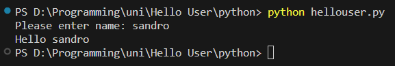

# Assignment 2
Screenshots for assignment N2
## Table of contents
- [Hello world](#Hello-World!)
    - [C](#C)
    - [Java](#Java)
    - [Python](#Python)
    - [Scala](#Scala)
- [Hello User](#Hello-User)
    - [C](#C)
    - [Java](#Java)
    - [Python](#Python)
- [Enviroment](#Enviroment)
    - [OS](#OS)
    - [Compilers](#Compilers)
        - [C](#C)
        - [Java](#Java)
        - [Python](#Python)

## Hello World!
    
### C

### Java

### Python

### Scala

## Hello User

### C

### Java

### Python

## Enviroment

### OS

### Compilers

1. C
    
2. Java
    
    
3. Python
    
4. Scala
    
    